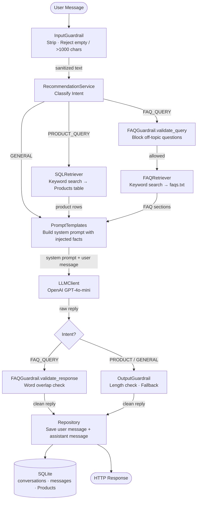

# Architecture

## Overview

The Carton Caps AI Chat Agent is a layered FastAPI service. Each incoming message passes through a pipeline of intent classification, retrieval, prompt engineering, LLM generation, and guardrail validation before a response is returned and persisted.

---

## System Layers

```
HTTP Request
     │
     ▼
┌─────────────┐
│  API Layer  │  FastAPI routers — conversations.py, messages.py
└──────┬──────┘
       │
       ▼
┌──────────────────┐
│ Input Guardrail  │  Validates length, strips whitespace
└──────┬───────────┘
       │
       ▼
┌──────────────────────┐
│ Intent Classifier    │  RecommendationService
│  PRODUCT_QUERY       │  Keyword-based routing
│  FAQ_QUERY           │
│  GENERAL             │
└──────┬───────────────┘
       │
       ├─── PRODUCT_QUERY ──► SQLRetriever → Products table
       │
       ├─── FAQ_QUERY ───────► FAQGuardrail (input) → FAQRetriever → faqs.txt
       │
       └─── GENERAL ─────────► No retrieval
       │
       ▼
┌──────────────────┐
│ Prompt Builder   │  PromptTemplates — injects retrieved facts into system prompt
└──────┬───────────┘
       │
       ▼
┌──────────────────┐
│  LLM Client      │  OpenAI GPT-4o-mini
└──────┬───────────┘
       │
       ▼
┌──────────────────────┐
│ Output Guardrail     │  OutputGuardrail (general) or FAQGuardrail (FAQ)
└──────┬───────────────┘
       │
       ▼
┌──────────────────┐
│  Repository      │  Saves user + assistant messages to SQLite
└──────┬───────────┘
       │
       ▼
  HTTP Response
```

---

## Intent Routing

| Intent | Trigger Keywords | Retriever | Guardrail |
|---|---|---|---|
| `PRODUCT_QUERY` | product, buy, snack, cereal, food, mac, granola, etc. | SQLRetriever | OutputGuardrail |
| `FAQ_QUERY` | referral, invite, bonus, refer, friend, link, onboarding, etc. | FAQRetriever | FAQGuardrail |
| `GENERAL` | anything else | None | OutputGuardrail |

---

## Retrieval

### SQL Retriever
Queries the `Products` table in SQLite. Searches by keyword match on product name. Falls back to returning the top 5 products if no keyword match is found.

### FAQ Retriever (RAG)
Loads `data/faqs.txt` into memory and splits it into sections by double newline. Matches sections against keywords in the user query. Returns the top matching sections as context for the LLM. Falls back to the first 3 sections if no match is found.

---

## Guardrails

### InputGuardrail
- Strips whitespace
- Rejects empty messages (400)
- Rejects messages over 1000 characters (400)

### OutputGuardrail
- Rejects responses shorter than 3 characters
- Returns a fallback apology message if validation fails

### FAQGuardrail
- `validate_query` — blocks questions unrelated to the Carton Caps referral program before retrieval (400)
- `validate_response` — checks the LLM reply has meaningful word overlap with the retrieved FAQ content; replaces off-topic responses with a fallback message

---

## Data Storage

### SQLite Database (`data/Carton Caps Data.sqlite`)

**conversations**
| Column | Type | Description |
|---|---|---|
| id | String (PK) | Prefixed UUID e.g. `c_abc12345` |
| user_id | String | User identifier |
| entry_point | String | Where the conversation was started |
| created_at | DateTime | UTC timestamp |

**messages**
| Column | Type | Description |
|---|---|---|
| id | String (PK) | Prefixed UUID e.g. `m_abc12345` |
| conversation_id | String (FK) | Parent conversation |
| role | String | `user` or `assistant` |
| content | String | Message text |
| intent | String | Classified intent |
| created_at | DateTime | UTC timestamp |

**Products**
| Column | Type | Description |
|---|---|---|
| id | Integer (PK) | Auto-increment |
| name | String | Product name |
| description | String | Product description |
| price | Real | Product price |
| created_at | String | Creation timestamp |

---

## Data Flow Diagram



---

## LLM Integration

- Provider: OpenAI
- Model: `gpt-4o-mini`
- Temperature: `0.7`
- Max tokens: `300`
- System prompt is dynamically built per intent with retrieved context injected
- API key loaded from `.env` via `python-dotenv`
