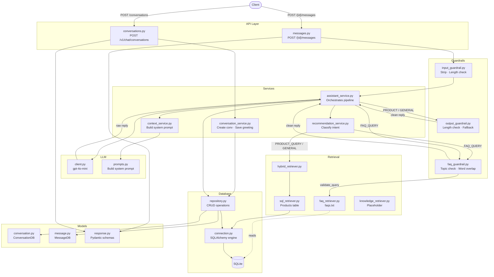

# Codebase Reference

A file-by-file breakdown of every `.py` file in the project, followed by an architecture diagram.

---

## Entry Point

### `app/main.py`
Bootstraps the FastAPI application. Creates all database tables on startup via SQLAlchemy, registers the two API routers (conversations and messages), and exposes a `/` health check endpoint.

---

## API Layer — `app/api/`

### `app/api/conversations.py`
Handles `POST /v1/chat/conversations`. Accepts an `entry_point` field, delegates to `ConversationService` to create a new conversation and generate the opening greeting from Capper, then returns the `conversation_id` and greeting text.

### `app/api/messages.py`
Handles `POST /v1/chat/conversations/{id}/messages`. Validates the conversation exists, runs the message through `InputGuardrail`, then passes it to `AssistantService` for the full processing pipeline. Returns the assistant reply, intent, and any retrieved data.

---

## Database Layer — `app/db/`

### `app/db/connection.py`
Sets up the SQLAlchemy engine and session factory. Reads `DATABASE_URL` from the environment, defaulting to the local SQLite file. Provides the `get_db` dependency used by FastAPI route handlers.

### `app/db/repository.py`
Data access layer. Contains three static methods: `create_conversation` (inserts a new conversation row), `get_conversation` (fetches by ID), and `save_message` (inserts a message row with role, content, and intent).

---

## Models — `app/models/`

### `app/models/conversation.py`
SQLAlchemy ORM model for the `conversations` table. Fields: `id` (auto-generated prefixed UUID), `user_id`, `entry_point`, `created_at`. Has a one-to-many relationship to `MessageDB`.

### `app/models/message.py`
SQLAlchemy ORM model for the `messages` table. Fields: `id`, `conversation_id` (FK), `role`, `content`, `intent`, `created_at`. Belongs to a `ConversationDB`.

### `app/models/response.py`
Pydantic request/response schemas used by the API layer:
- `CreateConversationRequest` — entry_point field
- `ConversationResponse` — conversation_id + greeting
- `SendMessageRequest` — content field
- `ChatMessageResponse` — message_id, role, intent, reply, retrieved_data

---

## Services — `app/services/`

### `app/services/conversation_service.py`
Creates a new conversation record and saves the opening greeting message (`"Hi! I am Capper..."`) to the database. Returns the conversation ID and greeting string.

### `app/services/assistant_service.py`
Orchestrates the full message pipeline in six steps:
1. Classify intent via `RecommendationService`
2. Route to `FAQRetriever` (with `FAQGuardrail` query check) or `HybridRetriever`
3. Build system prompt context via `ContextService`
4. Generate LLM response via `LLMClient`
5. Validate output via `FAQGuardrail` or `OutputGuardrail`
6. Persist both user and assistant messages to the database

### `app/services/context_service.py`
Thin wrapper that calls `PromptTemplates.build_system_prompt` with the intent and retrieved facts. Keeps the assistant service decoupled from prompt construction.

### `app/services/recommendation_service.py`
Keyword-based intent classifier. Scans the lowercased message for product-related words (`snack`, `buy`, `cereal`, etc.) → `PRODUCT_QUERY`; referral-related words (`referral`, `code`, `bonus`, etc.) → `FAQ_QUERY`; otherwise → `GENERAL`.

---

## LLM Layer — `app/llm/`

### `app/llm/client.py`
Wraps the OpenAI Python SDK. Loads the API key from `.env` via `python-dotenv`. Sends a system + user message pair to `gpt-4o-mini` with `max_tokens=300` and `temperature=0.7`, returning the response text.

### `app/llm/prompts.py`
Builds the system prompt string passed to the LLM. Injects product facts (name + price) for `PRODUCT_QUERY` intents, or FAQ section text for `FAQ_QUERY` intents. For `GENERAL`, returns a plain Capper identity prompt.

---

## Retrieval Layer — `app/retrieval/`

### `app/retrieval/sql_retriever.py`
Queries the `Products` table for `id`, `name`, `price`. First tries a `LIKE` keyword match on the last word of the query; falls back to the top 5 products if no match is found. Only runs for `PRODUCT_QUERY` intent.

### `app/retrieval/faq_retriever.py`
Loads `data/faqs.txt` (cached after first read). Splits the file by double newline into sections, then returns sections that contain any keyword from the query. Falls back to the first 3 sections if no keyword matches.

### `app/retrieval/hybrid_retriever.py`
Thin delegation layer that currently forwards all calls to `SQLRetriever`. Exists as an extension point for combining multiple retrieval strategies in the future.

### `app/retrieval/knowledge_retriever.py`
Placeholder for a future vector-based RAG retriever. Currently returns an empty list and is not wired into the active pipeline.

---

## Guardrails — `app/guardrails/`

### `app/guardrails/input_guardrail.py`
Validates incoming user messages before processing. Strips whitespace, raises HTTP 400 for empty messages, and raises HTTP 400 for messages exceeding 1000 characters.

### `app/guardrails/output_guardrail.py`
Validates the LLM's raw output. Returns a fallback apology string if the response is empty or fewer than 3 characters. Used for `PRODUCT_QUERY` and `GENERAL` intents.

### `app/guardrails/faq_guardrail.py`
Two-stage guardrail for FAQ flows:
- `validate_query` — blocks questions that don't contain any referral/program-related topic keywords (HTTP 400)
- `validate_response` — checks that the LLM reply has at least 5 words in common with the retrieved FAQ content; returns a fallback if not

---

## Tests — `tests/`

### `tests/test_unit.py`
14 unit tests covering:
- `InputGuardrail` — valid input, whitespace stripping, empty rejection, length rejection
- `OutputGuardrail` — valid output, empty fallback, short fallback
- `RecommendationService` — product, FAQ, and general intent classification
- `PromptTemplates` — prompt with and without facts
- `LLMClient` — general and product responses using `unittest.mock` to patch the OpenAI client

### `tests/test_integration.py`
7 integration tests using FastAPI's `TestClient`:
- Health check endpoint
- Conversation creation
- General, product, and invalid message sends
- Empty content rejection
- Multi-turn conversation flow

---

## Architecture Diagram



---

## File Map

```
app/
├── main.py                          # App entry point, router registration
├── api/
│   ├── conversations.py             # POST /v1/chat/conversations
│   └── messages.py                  # POST /v1/chat/conversations/{id}/messages
├── db/
│   ├── connection.py                # SQLAlchemy engine + session
│   └── repository.py               # DB CRUD operations
├── models/
│   ├── conversation.py              # ConversationDB ORM model
│   ├── message.py                   # MessageDB ORM model
│   └── response.py                  # Pydantic request/response schemas
├── services/
│   ├── assistant_service.py         # Full message pipeline orchestrator
│   ├── conversation_service.py      # Conversation creation + greeting
│   ├── context_service.py           # System prompt builder wrapper
│   └── recommendation_service.py   # Keyword intent classifier
├── llm/
│   ├── client.py                    # OpenAI GPT-4o-mini wrapper
│   └── prompts.py                   # System prompt templates
├── retrieval/
│   ├── sql_retriever.py             # Products table keyword search
│   ├── faq_retriever.py             # faqs.txt keyword search
│   ├── hybrid_retriever.py          # Delegates to SQLRetriever
│   └── knowledge_retriever.py      # Placeholder (unused)
└── guardrails/
    ├── input_guardrail.py           # Validate + sanitize user input
    ├── output_guardrail.py          # Validate LLM output
    └── faq_guardrail.py             # FAQ topic + response guardrail
tests/
├── test_unit.py                     # 14 unit tests (mocked LLM)
└── test_integration.py              # 7 integration tests (TestClient)
```
