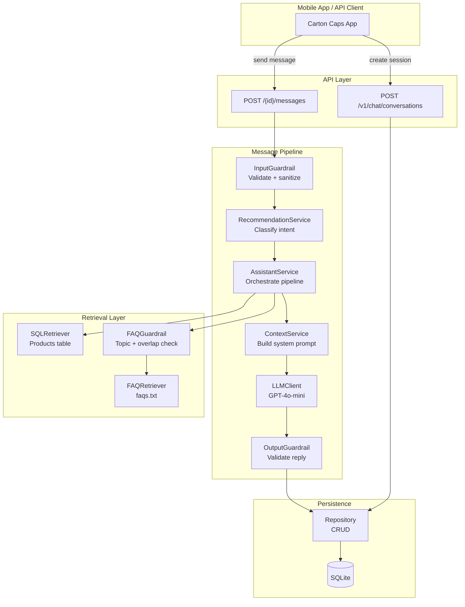
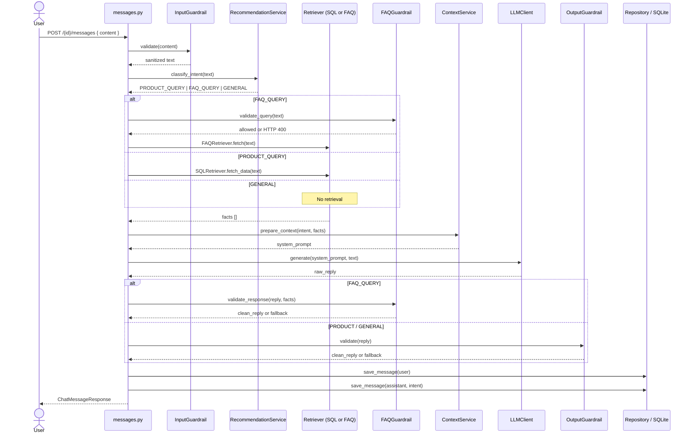
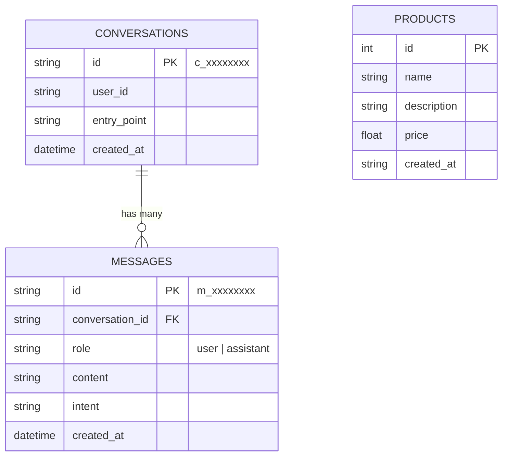
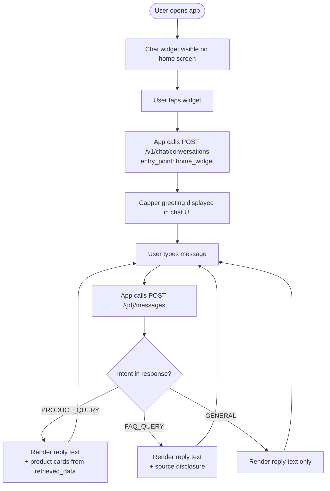

# Technical Specification — Carton Caps AI Chat Agent

**Deliverable #1: Conversational AI Design + LLM Strategy**

---

## Table of Contents

1. [Overview & Point of View](#1-overview--point-of-view)
2. [API Contract](#2-api-contract)
3. [System Diagrams](#3-system-diagrams)
4. [Mobile Integration](#4-mobile-integration)
5. [LLM Strategy & Reasoning](#5-llm-strategy--reasoning)
6. [Conversation Design Principles](#6-conversation-design-principles)
7. [Privacy Considerations](#7-privacy-considerations)
8. [Trade-offs & Alternatives Considered](#8-trade-offs--alternatives-considered)
9. [Evolution Roadmap](#9-evolution-roadmap)

---

## 1. Overview & Point of View

Capper is a scoped, task-oriented chat agent — not a general-purpose assistant. That distinction drove every design decision in this spec.

Carton Caps users open the app with a specific goal: find products that support their school, or understand how the referral program works. They are not looking for open-ended conversation. This means the agent should be fast, accurate within its domain, and honest about what it cannot help with — rather than attempting to answer everything and risking hallucination or off-brand responses.

The core design philosophy is: **constrain the LLM, don't trust it blindly.**

The LLM (GPT-4o-mini) is used as a language layer — it formats and communicates information retrieved from trusted sources (the product database and the FAQ file). It is not used as a knowledge source itself. Every response is grounded in data the system controls. This is the most important architectural decision in the project.

---

## 2. API Contract

The API follows REST conventions with a resource-oriented URL structure. All requests and responses use JSON.

**Base URL:** `http://localhost:8000`
**API Version:** `v1`

---

### 2.1 Endpoints

#### `POST /v1/chat/conversations`

Creates a new conversation session and returns Capper's opening greeting.

**Request**
```json
{
  "entry_point": "home_widget"
}
```

| Field | Type | Required | Default | Description |
|---|---|---|---|---|
| `entry_point` | string | No | `home_widget` | Surface in the app where the chat was opened. Used for analytics and future context-aware greetings. |

**Response `200`**
```json
{
  "conversation_id": "c_3f9a1b2c",
  "greeting": "Hi! I am Capper. I can help you find products that support your school!"
}
```

| Field | Type | Description |
|---|---|---|
| `conversation_id` | string | Unique session ID. Must be included in all subsequent message requests. |
| `greeting` | string | Capper's opening message. |

---

#### `POST /v1/chat/conversations/{conversation_id}/messages`

Sends a user message and returns Capper's response.

**Path Parameters**
| Parameter | Type | Description |
|---|---|---|
| `conversation_id` | string | ID returned from `POST /v1/chat/conversations` |

**Request**
```json
{
  "content": "What snacks support my school?"
}
```

| Field | Type | Required | Constraints | Description |
|---|---|---|---|---|
| `content` | string | Yes | 1–1000 characters | The user's message |

**Response `200`**
```json
{
  "message_id": "m_7c4d2e1f",
  "role": "assistant",
  "intent": "PRODUCT_QUERY",
  "reply": "Here are some snacks from our catalog that support your school:\n- Granola Cereal Bars — $5.92\n- Frosted Flakes Cereal — $3.79",
  "retrieved_data": [
    { "id": 2, "name": "Granola Cereal Bars", "price": 5.92 },
    { "id": 1, "name": "Frosted Flakes Cereal", "price": 3.79 }
  ]
}
```

| Field | Type | Description |
|---|---|---|
| `message_id` | string | Unique ID of the assistant's message |
| `role` | string | Always `"assistant"` |
| `intent` | string | Classified intent: `PRODUCT_QUERY`, `FAQ_QUERY`, or `GENERAL` |
| `reply` | string | Capper's natural language response |
| `retrieved_data` | array | Raw data used to ground the response. Empty array for `GENERAL` intent. |

**Error Responses**

| Status | Cause | Detail |
|---|---|---|
| `400` | Empty message | `"Message content cannot be empty."` |
| `400` | Message too long | `"Message exceeds maximum allowed length."` |
| `400` | FAQ guardrail blocked | `"I can only answer questions about the Carton Caps referral program..."` |
| `404` | Conversation not found | `"Conversation not found"` |

All errors use the format:
```json
{ "detail": "<reason>" }
```

---

### 2.2 Intent Classification

Every message is classified into one of three intents before retrieval or generation occurs.

| Intent | Trigger | Retriever | Output Guardrail |
|---|---|---|---|
| `PRODUCT_QUERY` | Keywords: product, buy, snack, cereal, food, granola, etc. | SQLRetriever → Products table | OutputGuardrail |
| `FAQ_QUERY` | Keywords: referral, invite, bonus, code, friend, reward, etc. | FAQRetriever → faqs.txt | FAQGuardrail |
| `GENERAL` | No keyword match | None | OutputGuardrail |

---

### 2.3 Conversation Lifecycle

```
POST /v1/chat/conversations
        │
        ▼
  conversation_id returned
        │
        ▼
POST /v1/chat/conversations/{id}/messages  ◄──┐
        │                                      │
        ▼                                      │
  reply returned                               │
        │                                      │
        └──────── user sends next message ─────┘
```

Conversations are persistent. All messages (user and assistant) are stored in the database with their intent labels, enabling future history retrieval, analytics, and multi-turn context.

---

## 3. System Diagrams

### 3.1 Component Architecture



---

### 3.2 Message Pipeline — Sequence Diagram



---

### 3.3 Data Model



---

## 4. Mobile Integration

### 4.1 Integration Pattern

The Carton Caps mobile app (iOS/Android) integrates with the chat agent as a standard REST client. No SDK is required — the app makes two types of HTTP calls.

**Recommended flow:**

```
App Launch / Chat Widget Opened
        │
        ▼
POST /v1/chat/conversations
{ "entry_point": "home_widget" }
        │
        ▼
Store conversation_id in local session state
        │
        ▼
User types message → POST /v1/chat/conversations/{id}/messages
        │
        ▼
Render reply in chat UI
Use retrieved_data to render product cards if intent == PRODUCT_QUERY
```

---

### 4.2 Entry Points

The `entry_point` field allows the app to tell the API where the chat was opened. This enables context-aware greetings and analytics in the future.

| Entry Point | Surface |
|---|---|
| `home_widget` | Home screen chat bubble |
| `product_page` | Chat opened from a product detail page |
| `referral_page` | Chat opened from the referral/invite screen |
| `onboarding` | Chat opened during new user onboarding |

A future version of the API could use `entry_point` to pre-seed the conversation with relevant context — e.g. opening from `referral_page` could automatically prime Capper to answer referral questions without the user needing to ask.

---

### 4.3 Rendering `retrieved_data`

The `retrieved_data` array in the message response is intentionally returned as structured data separate from the `reply` string. This allows the mobile app to render rich UI components rather than parsing text.

**Example — Product Query:**
```json
"retrieved_data": [
  { "id": 1, "name": "Frosted Flakes Cereal", "price": 3.79 },
  { "id": 2, "name": "Granola Cereal Bars", "price": 5.92 }
]
```

The app can use this to render tappable product cards with images, prices, and "Add to Cart" buttons — while `reply` provides the conversational framing text above the cards.

**Example — FAQ Query:**
```json
"retrieved_data": [
  { "content": "Q: How do I refer a friend?\nA: Share your unique referral link..." }
]
```

For FAQ responses, `retrieved_data` can be used to show a "Source" disclosure, building user trust that the answer came from official program documentation.

---

### 4.4 Authentication

The current implementation uses a hardcoded `user_id` (`user_demo_123`) as a placeholder. In production, the mobile app would pass a JWT or session token in the `Authorization` header, and the API would extract the `user_id` from the verified token rather than trusting a client-supplied value.

```
Authorization: Bearer <jwt_token>
```

The `user_id` is stored on the conversation record, enabling per-user conversation history retrieval in a future `GET /v1/chat/conversations` endpoint.

---

### 4.5 Suggested Mobile UX Flow



---

## 5. LLM Strategy & Reasoning

### 5.1 Why GPT-4o-mini

GPT-4o-mini was chosen over larger models (GPT-4o, GPT-4-turbo) for three reasons:

1. **Latency** — Chat agents live or die on response time. GPT-4o-mini returns responses significantly faster than full GPT-4o, which matters when a user is waiting in a mobile chat UI.
2. **Cost** — At scale, token costs compound quickly. GPT-4o-mini is ~15x cheaper per token than GPT-4o. For a consumer app with potentially thousands of daily conversations, this is a meaningful operational consideration.
3. **Task fit** — The tasks Capper performs (formatting product lists, paraphrasing FAQ content) do not require the reasoning depth of a larger model. GPT-4o-mini handles them well within the constrained prompt structure used here.

The trade-off is that GPT-4o-mini is weaker at nuanced reasoning and longer context. This is acceptable because the system is designed so the LLM never needs to reason — it only needs to communicate.

---

### 5.2 Grounded Generation (Why the LLM Is Not the Knowledge Source)

The most important LLM design decision is that **the model is never asked to recall facts from its training data.** Every response is grounded in one of two sources:

- The `Products` table in SQLite (for product queries)
- `data/faqs.txt` (for referral/program questions)

The system prompt explicitly injects the relevant facts before asking the LLM to respond. This eliminates hallucination risk for the two most critical query types. The LLM's job is to take structured data and express it naturally — not to know things.

For `GENERAL` intent (greetings, small talk), the LLM responds from its own capability, but this is low-risk because no factual claims are being made.

---

### 5.3 Prompt Design

The system prompt is built dynamically per request with three components:

1. **Identity** — "You are Capper, a helpful assistant for the Carton Caps app."
2. **Intent scope** — Tells the model what kind of question it is answering.
3. **Injected facts** — Product rows or FAQ sections retrieved from trusted sources.

This structure keeps the prompt minimal and focused. The model is not given open-ended instructions like "answer any question the user has" — it is given a specific task with specific data.

**Temperature: 0.7** — Allows natural variation in phrasing without producing unpredictable outputs. A lower temperature (0.3–0.5) would be appropriate if responses needed to be more deterministic (e.g. for compliance-sensitive content).

**Max tokens: 300** — Sufficient for a conversational reply with a short product list or FAQ answer. Prevents runaway responses and controls cost.

---

### 5.4 Guardrail Strategy

Three guardrails operate at different stages of the pipeline:

| Guardrail | Stage | Purpose |
|---|---|---|
| `InputGuardrail` | Pre-classification | Reject malformed or abusive input before any processing occurs |
| `FAQGuardrail.validate_query` | Pre-retrieval | Block questions outside the referral program scope before calling the LLM |
| `FAQGuardrail.validate_response` | Post-generation | Verify the LLM's reply is grounded in the retrieved FAQ content |
| `OutputGuardrail` | Post-generation | Catch degenerate LLM outputs (empty, too short) |

The FAQ guardrails are the most important. They enforce a hard boundary: Capper will not speculate about the referral program. If the LLM produces a response that doesn't overlap meaningfully with the retrieved FAQ content, it is replaced with a fallback. This is a conservative but correct choice for a consumer-facing product where incorrect referral information could cause real user harm (e.g. a user acting on wrong bonus information).

---

## 6. Conversation Design Principles

### 6.1 Capper's Persona

Capper is friendly, concise, and task-focused. The name and personality are intentionally simple — a mascot-style assistant that feels approachable to a broad consumer audience including families and students.

Design rules for Capper's responses:
- Always answer the question directly before adding context
- Never claim to know something outside the product catalog or FAQ
- Use plain language — no jargon, no markdown formatting in replies
- Keep responses short (1–4 sentences + data) — mobile screens are small

---

### 6.2 Handling Out-of-Scope Questions

When a user asks something Capper cannot answer (e.g. "What's the weather today?"), the system returns a `GENERAL` intent response. The LLM is prompted as Capper and will naturally redirect the user toward what it can help with.

For FAQ questions that don't match the allowed topic list, the `FAQGuardrail` returns an explicit HTTP 400 with a message explaining what Capper can help with. This is intentionally transparent — it is better to tell the user what the agent cannot do than to generate a plausible-sounding but wrong answer.

---

### 6.3 Multi-Turn Conversations

All messages are persisted to the database with their conversation ID. The current implementation does not inject conversation history into the LLM prompt — each message is processed independently. This is a deliberate simplification for v1.

The infrastructure for multi-turn context is already in place (messages table with conversation_id FK). Injecting the last N turns into the system prompt is a straightforward v2 addition.

---

### 6.4 Entry Point as Context Signal

The `entry_point` field is a lightweight mechanism for the app to signal user intent before the first message is sent. A user who opens the chat from the referral page is almost certainly going to ask a referral question. Future versions can use this to:
- Pre-classify the first message
- Customize the greeting
- Skip the intent classification step for the first turn

---

## 7. Privacy Considerations

### 7.1 What Data Is Stored

Every conversation and message is persisted to the SQLite database. The stored fields are:

| Data | Stored | Notes |
|---|---|---|
| `user_id` | Yes | Currently a hardcoded demo value. In production, derived from auth token — never client-supplied. |
| `entry_point` | Yes | App surface only — no PII |
| Message content | Yes | Full text of every user message and assistant reply |
| Intent label | Yes | Classified intent per message |
| Timestamps | Yes | UTC, message-level |

**Message content is the most sensitive field.** Users may include personal information in their messages (e.g. "I'm buying snacks for my daughter's school"). This should be treated as PII in a production system.

---

### 7.2 Recommendations for Production

- **Do not log raw message content** to application logs or monitoring systems. Log only message IDs and intents.
- **Encrypt the SQLite database at rest** or migrate to a managed database (RDS, Aurora) with encryption enabled.
- **Apply a retention policy** — conversation data should not be stored indefinitely. A 90-day rolling deletion policy is a reasonable starting point.
- **Do not send PII to OpenAI** — review OpenAI's data usage policy. If users may include sensitive information in messages, consider a PII scrubbing step in `InputGuardrail` before the message is sent to the LLM.
- **Auth token validation** — the `user_id` must be extracted from a verified JWT, never from the request body.
- **HTTPS only** — all API traffic must be encrypted in transit. The current `localhost` setup is for development only.

---

### 7.3 OpenAI Data Handling

Messages sent to GPT-4o-mini via the OpenAI API are subject to OpenAI's data usage policies. By default, OpenAI does not use API data for model training (as of their current policy), but this should be confirmed and documented for any production deployment. Consider a Data Processing Agreement (DPA) with OpenAI if handling data from minors, given Carton Caps' school-focused audience.

---

## 8. Trade-offs & Alternatives Considered

### 8.1 Keyword Intent Classification vs. LLM Classification

**Current approach:** Keyword matching in `RecommendationService`.

**Alternative:** Use the LLM itself to classify intent (zero-shot or few-shot classification prompt).

**Why keyword matching was chosen:**
- Zero latency — no extra API call
- Zero cost — no tokens consumed
- Fully deterministic — same input always produces same intent
- Easy to debug and extend

**The trade-off:** Keyword matching fails on paraphrases. "What can I purchase?" won't match the product keywords. An LLM classifier would handle this naturally. This is the most likely first upgrade in v2.

---

### 8.2 File-Based FAQ vs. Vector Database

**Current approach:** `faqs.txt` loaded into memory, keyword-matched by section.

**Alternative:** Embed FAQ sections into a vector database (Pinecone, pgvector, ChromaDB) and retrieve by semantic similarity.

**Why file-based was chosen:**
- 11 FAQ entries — vector search is unnecessary overhead at this scale
- No infrastructure dependency — no vector DB to provision or maintain
- Keyword matching is sufficient when the FAQ is small and well-structured

**The trade-off:** As the FAQ grows (50+ entries, multiple document types), keyword matching degrades. Semantic search becomes necessary when users ask questions that don't share vocabulary with the answer (e.g. "Can I get in trouble for gaming the system?" → should match the abuse/restriction FAQ).

---

### 8.3 SQLite vs. Production Database

**Current approach:** SQLite file on disk.

**Why SQLite was chosen:** Zero setup, portable, sufficient for a single-instance development service.

**Production path:** Migrate to PostgreSQL (RDS or Aurora Serverless). The SQLAlchemy abstraction means this is a one-line change to `DATABASE_URL` — no application code changes required.

---

### 8.4 Stateless Message Processing vs. Conversation History in Prompt

**Current approach:** Each message is processed independently. No history is injected into the LLM prompt.

**Trade-off:** The LLM cannot refer back to earlier turns. If a user asks "What about the second one?" after a product list, Capper won't know what "the second one" refers to.

**Why this was accepted for v1:** Injecting history adds tokens (cost + latency) and requires careful truncation logic to avoid exceeding context limits. For a task-oriented agent where most queries are self-contained, stateless processing is a reasonable v1 simplification. The database already stores the full history — wiring it into the prompt is a contained v2 change.

---

## 9. Evolution Roadmap

These are ordered by impact vs. implementation effort.

### Near-term (v2)

| Change | Why |
|---|---|
| Inject last N conversation turns into LLM prompt | Enables true multi-turn context — "What about the second one?" becomes answerable |
| Replace keyword intent classifier with LLM zero-shot classification | Handles paraphrases and edge cases the keyword list misses |
| Add `GET /v1/chat/conversations/{id}/messages` endpoint | Allows the app to restore chat history on re-open |
| JWT authentication | Replace hardcoded `user_id` with real user identity |

### Medium-term (v3)

| Change | Why |
|---|---|
| Migrate to PostgreSQL | Production-grade persistence, concurrent writes, encryption at rest |
| Semantic FAQ retrieval (vector embeddings) | Handles a growing FAQ corpus and vocabulary mismatch |
| `entry_point`-aware greeting and pre-classification | Reduces friction for users who open chat from a specific context |
| Streaming responses | Improves perceived latency on mobile — text appears as it generates |

### Longer-term

| Change | Why |
|---|---|
| Per-user conversation history and personalization | "You asked about granola bars last week — we have a new one" |
| Product recommendation engine integration | Move beyond keyword search to collaborative filtering or embeddings |
| Feedback loop (thumbs up/down on replies) | Collect signal to evaluate and improve response quality over time |
| A/B testing framework for prompts | Systematically improve Capper's tone, accuracy, and conversion |
| Fallback to human support | For queries Capper cannot handle, offer a handoff to a human agent |
